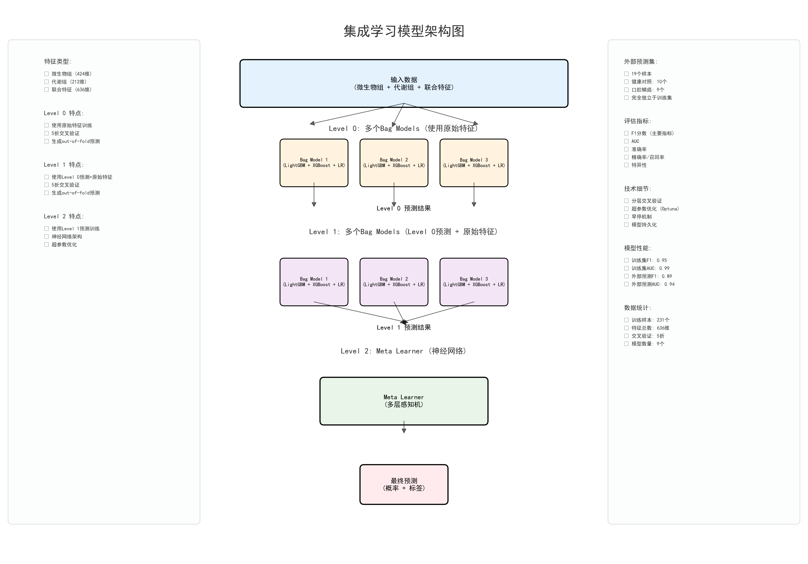

# 🧪 OSCC Multi-Omics Diagnostic Model
Exhaled VOCs + Salivary Microbiome Fusion Model for Oral Squamous Cell Carcinoma (OSCC)  
Repository: https://github.com/SunYilan/biomodel  
License: Apache-2.0 license  

## 1. Overview
This repository provides the complete implementation of an AI-powered multi-omics diagnostic model designed for the noninvasive detection of oral squamous cell carcinoma (OSCC). The model integrates two key data modalities:
- Exhaled breath volatile organic compounds (VOCs) profiled by Proton Transfer Reaction Time-of-Flight Mass Spectrometry (PTR–TOF–MS)
- Salivary microbiome features derived from shotgun metagenomic sequencing

Employing a stacked ensemble architecture with three feature-integration layers, the model delivers robust diagnostic performance across both discovery and external validation cohorts. This repository aims to enhance research transparency and reproducibility, while facilitating future cross-cohort or multi-center validation studies.

## 2. 🧠 Model Architecture
### Architecture Diagram

*Figure 1: Three-level fusion framework of the OSCC diagnostic model. Level-0: Modality-specific base learners (LightGBM/XGBoost/Logistic Regression) for VOCs and microbiome data; Level-1: Feature integration layer concatenating logits and transformed features; Level-2: MLP meta-learner with regularization for cross-modal interaction learning.*

The model is built on a three-level fusion framework:
- **Level-0 — Base Learners (Modality-specific models)**  
  LightGBM, XGBoost, and Logistic Regression. Each modality (VOCs, salivary microbiome) is trained independently using these multiple algorithms to capture complementary data structure characteristics.
- **Level-1 — Feature Integration Layer**  
  Outputs (predicted logits + transformed features) from all Level-0 models are concatenated to form a unified feature representation.
- **Level-2 — Meta-Learner (Final Classifier)**  
  A multilayer perceptron (MLP) equipped with:
  - Dropout regularization
  - Early stopping
  - L2 weight penalties  
  This layer learns nonlinear cross-modal interactions, thereby improving diagnostic accuracy and interpretability.

## 3. Performance Summary
- Discovery cohort (n=222): AUC = 1.00
- External validation cohort (n=83): AUC = 0.923  
The model maintains strong robustness even with moderate distribution shift between cohorts (PSI = 0.10-0.25).

---

📚 **Citation**  
If you use this model, dataset format, or code, please cite:  
Sun Y., et al. *Rapid and Noninvasive Artificial Intelligence-Assisted Diagnostic Method for Oral Squamous Cell Carcinoma Based on Breath Analysis Using Proton Transfer Reaction Time-of-Flight Mass Spectrometry* (Manuscript in review)

📞 **Contact**  
For questions, usage support, or collaboration inquiries, please contact:  
Yilan Sun  
Email: yilansun@126.com  
Shanghai Ninth People’s Hospital, Shanghai Jiao Tong University School of Medicine  

Dr. Jiannan Liu (Corresponding Author)  
Email: laurence_ljn@163.com
